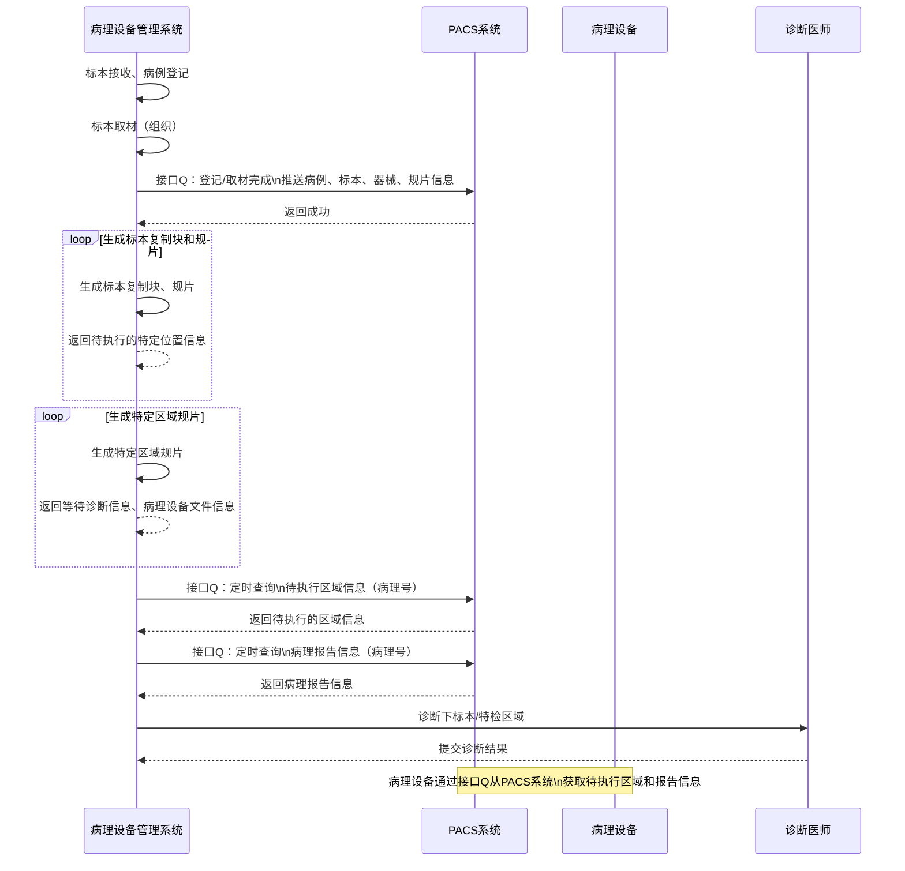

```mermaid
%% 时序图：病理设备管理系统流程
sequenceDiagram
    participant 病理设备管理系统
    participant PACS系统
    participant 病理设备
    participant 诊断医师

    病理设备管理系统->>病理设备管理系统: 标本接收、病例登记
    病理设备管理系统->>病理设备管理系统: 标本取材（组织）
    
    病理设备管理系统->>PACS系统: 接口Q：登记/取材完成\n推送病例、标本、器械、规片信息
    PACS系统-->>病理设备管理系统: 返回成功
    
    loop 生成标本复制块和规片
        病理设备管理系统->>病理设备管理系统: 生成标本复制块、规片
        病理设备管理系统-->>病理设备管理系统: 返回待执行的特定位置信息
    end
    
    loop 生成特定区域规片
        病理设备管理系统->>病理设备管理系统: 生成特定区域规片
        病理设备管理系统-->>病理设备管理系统: 返回等待诊断信息、病理设备文件信息
    end
    
    病理设备管理系统->>PACS系统: 接口Q：定时查询\n待执行区域信息（病理号）
    PACS系统-->>病理设备管理系统: 返回待执行的区域信息
    
    病理设备管理系统->>PACS系统: 接口Q：定时查询\n病理报告信息（病理号）
    PACS系统-->>病理设备管理系统: 返回病理报告信息
    
    病理设备管理系统->>诊断医师: 诊断下标本/特检区域
    诊断医师-->>病理设备管理系统: 提交诊断结果
    
    Note over 病理设备,PACS系统: 病理设备通过接口Q从PACS系统\n获取待执行区域和报告信息
```