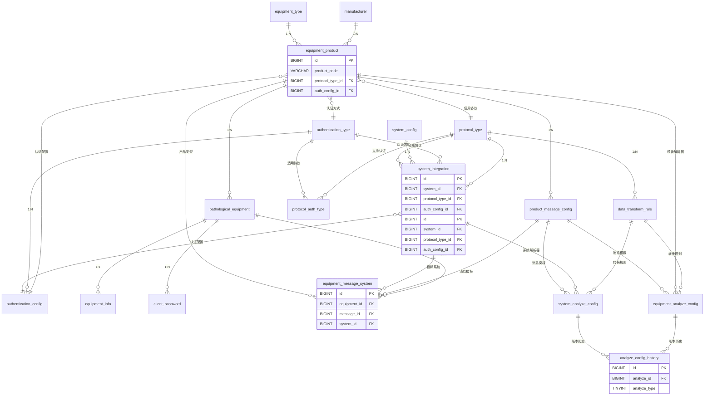

```mermaid
erDiagram
    %% 核心实体

    
    manufacturer ||--o{ equipment_product : "1:N"
    equipment_type ||--o{ equipment_product : "1:N"
    
    %% 设备产品关系组
    equipment_product ||--o{ pathological_equipment : "1:N"
    equipment_product ||--o{ product_message_config : "1:N"
    equipment_product }o--|| protocol_type : "使用协议"
    equipment_product }o--|| authentication_type : "认证方式"
    equipment_product }o--|| authentication_config : "认证配置"
    
    pathological_equipment ||--o{ equipment_info : "1:1"
    pathological_equipment ||--o{ client_password : "1:N"
    pathological_equipment ||--o{ equipment_message_system : "消息路由"
    
    %% 协议认证关系组
    protocol_type ||--o{ data_transform_rule : "1:N"
    protocol_type ||--o{ system_integration : "1:N"
    protocol_type ||--o{ protocol_auth_type : "支持认证"
    
    authentication_type ||--o{ protocol_auth_type : "适用协议"
    authentication_type ||--o{ authentication_config : "1:N"
    authentication_type ||--o{ system_integration : "认证方式"
    
    %% 系统集成关系组
    system_config ||--o{ system_integration : "1:N"
    system_integration }o--|| protocol_type : "使用协议"
    system_integration }o--|| authentication_config : "认证配置"
    
    %% 消息路由组
    product_message_config ||--o{ equipment_message_system : "消息模板"
    system_integration ||--o{ equipment_message_system : "目标系统"
    equipment_message_system }o--|| equipment_product : "产品类型"
    
    %% 解析器配置组
    data_transform_rule ||--o{ equipment_analyze_config : "转换规则"
    data_transform_rule ||--o{ system_analyze_config : "转换规则"
    
    equipment_analyze_config ||--o{ analyze_config_history : "版本历史"
    system_analyze_config ||--o{ analyze_config_history : "版本历史"
    
    equipment_product ||--o{ equipment_analyze_config : "设备解析器"
    system_integration ||--o{ system_analyze_config : "系统解析器"
    product_message_config ||--o{ equipment_analyze_config : "消息模板"
    product_message_config ||--o{ system_analyze_config : "消息模板"

    %% 详细字段展示（关键表示例）    
    equipment_product {
        BIGINT id PK
        VARCHAR product_code
        BIGINT protocol_type_id FK
        BIGINT auth_config_id FK
    }

    system_integration {
        BIGINT id PK
        BIGINT system_id FK
        BIGINT protocol_type_id FK
        BIGINT auth_config_id FK
    }    
    system_integration {
        BIGINT id PK
        BIGINT system_id FK
        BIGINT protocol_type_id FK
        BIGINT auth_config_id FK
    }
    
    equipment_message_system {
        BIGINT id PK
        BIGINT equipment_id FK
        BIGINT message_id FK
        BIGINT system_id FK
    }
    
    analyze_config_history {
        BIGINT id PK
        BIGINT analyze_id FK
        TINYINT analyze_type
    }
          
```