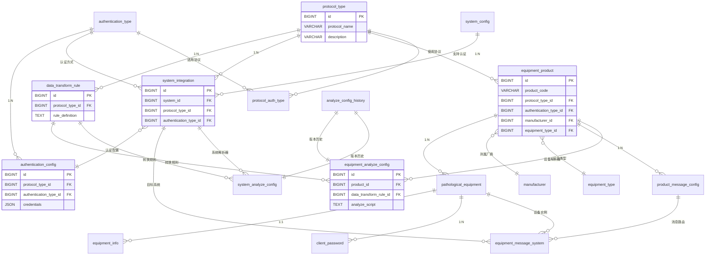

```mermaid
erDiagram
    %% 设备核心信息组
    equipment_product ||--o{ pathological_equipment : "1:N"
    equipment_product }o--|| manufacturer : "所属厂商"
    equipment_product }o--|| equipment_type : "设备类型"
    pathological_equipment ||--o{ equipment_info : "1:1"
    pathological_equipment ||--o{ client_password : "1:N"

    %% 协议与认证组
    protocol_type ||--o{ data_transform_rule : "1:N"
    protocol_type ||--o{ system_integration : "1:N"
    protocol_type ||--o{ equipment_product : "使用协议"
    
    authentication_type ||--o{ authentication_config : "1:N"
    authentication_type ||--o{ system_integration : "认证方式"
    protocol_type ||--o{ protocol_auth_type : "支持认证"
    authentication_type ||--o{ protocol_auth_type : "适用协议"
    
    %% 系统集成组
    system_config ||--o{ system_integration : "1:N"
    system_integration }o--|| authentication_config : "认证配置"
    
    %% 消息路由组
    equipment_product ||--o{ product_message_config : "1:N"
    product_message_config ||--o{ equipment_message_system : "消息路由"
    system_integration ||--o{ equipment_message_system : "目标系统"
    pathological_equipment ||--o{ equipment_message_system : "设备实例"

    %% 解析器配置组
    data_transform_rule ||--o{ equipment_analyze_config : "转换规则"
    data_transform_rule ||--o{ system_analyze_config : "转换规则"
    equipment_product ||--o{ equipment_analyze_config : "设备解析器"
    system_integration ||--o{ system_analyze_config : "系统解析器"
    analyze_config_history ||--|| equipment_analyze_config : "版本历史"
    analyze_config_history ||--|| system_analyze_config : "版本历史"

    %% 实体表结构详情
    equipment_product {
        BIGINT id PK
        VARCHAR product_code
        BIGINT protocol_type_id FK
        BIGINT authentication_type_id FK
        BIGINT manufacturer_id FK
        BIGINT equipment_type_id FK
    }
    
    protocol_type {
        BIGINT id PK
        VARCHAR protocol_name
        VARCHAR description
    }
    
    system_integration {
        BIGINT id PK
        BIGINT system_id FK
        BIGINT protocol_type_id FK
        BIGINT authentication_type_id FK
    }
    
    equipment_analyze_config {
        BIGINT id PK
        BIGINT product_id FK
        BIGINT data_transform_rule_id FK
        TEXT analyze_script
    }
    
    data_transform_rule {
        BIGINT id PK
        BIGINT protocol_type_id FK
        TEXT rule_definition
    }
    
    authentication_config {
        BIGINT id PK
        BIGINT protocol_type_id FK
        BIGINT authentication_type_id FK
        JSON credentials
    }
          
```