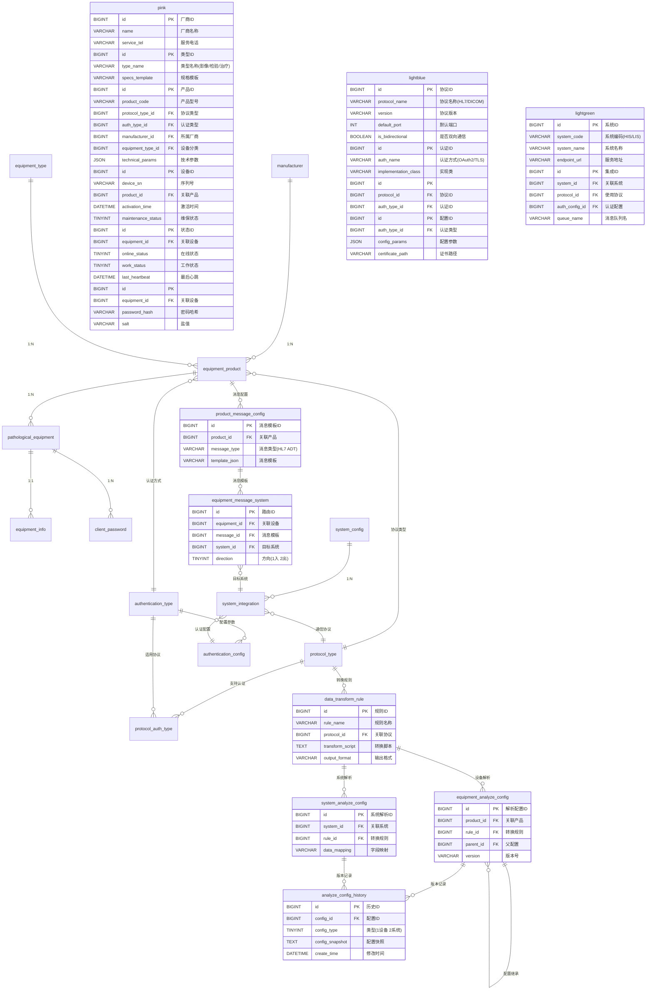

```mermaid
erDiagram
    %% 颜色说明
    %% #pink:设备核心表 #lightblue:协议相关 #lightgreen:系统集成 #orange:解析配置

    %% ================= 设备域 ====================
    manufacturer pink {
        BIGINT id PK "厂商ID"
        VARCHAR name "厂商名称"
        VARCHAR service_tel "服务电话"
    }
    
    equipment_type pink {
        BIGINT id PK "类型ID"
        VARCHAR type_name "类型名称(影像/检验/治疗)"
        VARCHAR specs_template "规格模板"
    }
    
    equipment_product pink {
        BIGINT id PK "产品ID"
        VARCHAR product_code "产品型号"
        BIGINT protocol_type_id FK "协议类型"
        BIGINT auth_type_id FK "认证类型"
        BIGINT manufacturer_id FK "所属厂商"
        BIGINT equipment_type_id FK "设备分类"
        JSON technical_params "技术参数"
    }
    
    pathological_equipment pink {
        BIGINT id PK "设备ID"
        VARCHAR device_sn "序列号"
        BIGINT product_id FK "关联产品"
        DATETIME activation_time "激活时间"
        TINYINT maintenance_status "维保状态"
    }
    
    equipment_info pink {
        BIGINT id PK "状态ID"
        BIGINT equipment_id FK "关联设备"
        TINYINT online_status "在线状态"
        TINYINT work_status "工作状态"
        DATETIME last_heartbeat "最后心跳"
    }
    
    client_password pink {
        BIGINT id PK
        BIGINT equipment_id FK "关联设备"
        VARCHAR password_hash "密码哈希"
        VARCHAR salt "盐值"
    }

    %% ================= 协议域 ====================
    protocol_type lightblue {
        BIGINT id PK "协议ID"
        VARCHAR protocol_name "协议名称(HL7/DICOM)"
        VARCHAR version "协议版本"
        INT default_port "默认端口"
        BOOLEAN is_bidirectional "是否双向通信"
    }
    
    authentication_type lightblue {
        BIGINT id PK "认证ID"
        VARCHAR auth_name "认证方式(OAuth2/TLS)"
        VARCHAR implementation_class "实现类"
    }
    
    protocol_auth_type lightblue {
        BIGINT id PK
        BIGINT protocol_id FK "协议ID"
        BIGINT auth_type_id FK "认证ID"
    }
    
    authentication_config lightblue {
        BIGINT id PK "配置ID"
        BIGINT auth_type_id FK "认证类型"
        JSON config_params "配置参数"
        VARCHAR certificate_path "证书路径"
    }

    %% ================= 系统集成域 ====================
    system_config lightgreen {
        BIGINT id PK "系统ID"
        VARCHAR system_code "系统编码(HIS/LIS)"
        VARCHAR system_name "系统名称"
        VARCHAR endpoint_url "服务地址"
    }
    
    system_integration lightgreen {
        BIGINT id PK "集成ID"
        BIGINT system_id FK "关联系统"
        BIGINT protocol_id FK "使用协议"
        BIGINT auth_config_id FK "认证配置"
        VARCHAR queue_name "消息队列名"
    }
    
    product_message_config {
        BIGINT id PK "消息模板ID"
        BIGINT product_id FK "关联产品"
        VARCHAR message_type "消息类型(HL7 ADT)"
        VARCHAR template_json "消息模板"
    }
    
    equipment_message_system {
        BIGINT id PK "路由ID"
        BIGINT equipment_id FK "关联设备"
        BIGINT message_id FK "消息模板"
        BIGINT system_id FK "目标系统"
        TINYINT direction "方向(1入 2出)"
    }

    %% ================= 解析配置域 ====================
    data_transform_rule {
        BIGINT id PK "规则ID"
        VARCHAR rule_name "规则名称"
        BIGINT protocol_id FK "关联协议"
        TEXT transform_script "转换脚本"
        VARCHAR output_format "输出格式"
    }
    
    equipment_analyze_config {
        BIGINT id PK "解析配置ID"
        BIGINT product_id FK "关联产品"
        BIGINT rule_id FK "转换规则"
        BIGINT parent_id FK "父配置"
        VARCHAR version "版本号"
    }
    
    system_analyze_config {
        BIGINT id PK "系统解析ID"
        BIGINT system_id FK "关联系统"
        BIGINT rule_id FK "转换规则"
        VARCHAR data_mapping "字段映射"
    }
    
    analyze_config_history {
        BIGINT id PK "历史ID"
        BIGINT config_id FK "配置ID"
        TINYINT config_type "类型(1设备 2系统)"
        TEXT config_snapshot "配置快照"
        DATETIME create_time "修改时间"
    }

    %% ================= 关系连接 ====================
    manufacturer ||--o{ equipment_product : "1:N"
    equipment_type ||--o{ equipment_product : "1:N"
    equipment_product ||--o{ pathological_equipment : "1:N"
    equipment_product }o--|| protocol_type : "协议类型"
    equipment_product }o--|| authentication_type : "认证方式"
    pathological_equipment ||--o{ equipment_info : "1:1"
    pathological_equipment ||--o{ client_password : "1:N"
    
    protocol_type ||--o{ data_transform_rule : "转换规则"
    protocol_type ||--o{ protocol_auth_type : "支持认证"
    authentication_type ||--o{ protocol_auth_type : "适用协议"
    authentication_type ||--o{ authentication_config : "配置参数"
    
    system_config ||--o{ system_integration : "1:N"
    system_integration }o--|| protocol_type : "通信协议"
    system_integration }o--|| authentication_config : "认证配置"
    
    product_message_config ||--o{ equipment_message_system : "消息模板"
    equipment_product ||--o{ product_message_config : "消息配置"
    equipment_message_system }o--|| system_integration : "目标系统"
    
    data_transform_rule ||--o{ equipment_analyze_config : "设备解析"
    data_transform_rule ||--o{ system_analyze_config : "系统解析"
    equipment_analyze_config ||--o{ analyze_config_history : "版本记录"
    system_analyze_config ||--o{ analyze_config_history : "版本记录"
    equipment_analyze_config ||--o{ equipment_analyze_config : "配置继承"
          
```