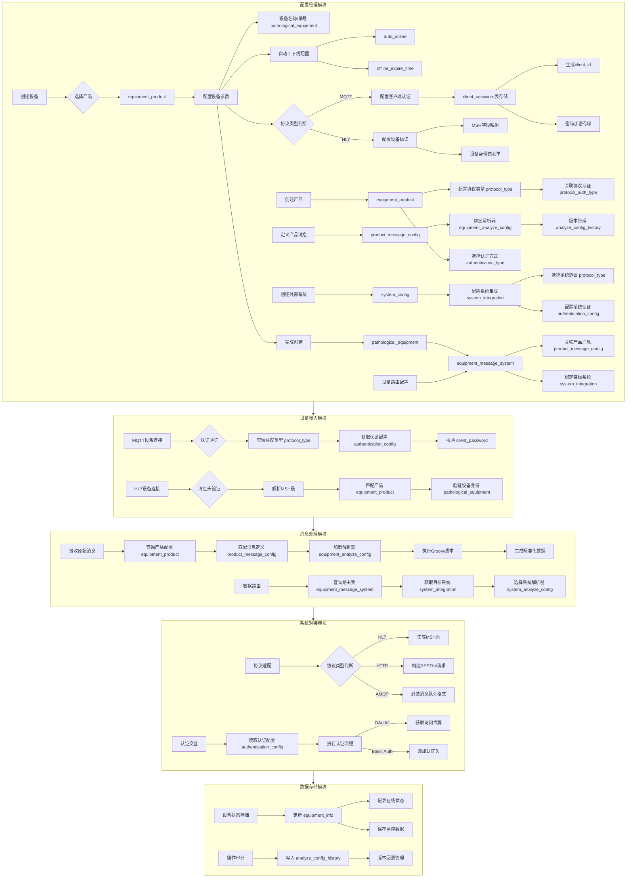

```mermaid
flowchart TD
    subgraph 配置管理模块
        %% 新增设备配置流程 %%
        Z1[创建设备] --> Z2{选择产品}
        Z2 --> Z3[equipment_product]
        Z3 --> Z4[配置设备参数]
        Z4 --> Z41[设备名称/编号 pathological_equipment]
        Z4 --> Z42[自动上下线配置]
        Z42 --> Z421[auto_online]
        Z42 --> Z422[offline_expire_time]
        
        Z4 --> Z5{协议类型判断}
        Z5 -->|MQTT| Z6[配置客户端认证]
        Z6 --> Z61[client_password表存储]
        Z61 --> Z62[生成client_id]
        Z61 --> Z63[密码加密存储]
        
        Z5 -->|HL7| Z7[配置设备标识]
        Z7 --> Z71[MSH字段映射]
        Z7 --> Z72[设备身份白名单]
        
        Z4 --> Z8[完成创建]
        Z8 --> Z9[pathological_equipment]
        %% 原有关联流程 %%
        Z9 --> D2[设备路由配置]

        A1[创建产品] --> A2[equipment_product]
        A2 --> A3[配置协议类型 protocol_type]
        A2 --> A4[选择认证方式 authentication_type]
        A3 --> A5[关联协议认证 protocol_auth_type]
        
        B1[定义产品消息] --> B2[product_message_config]
        B2 --> B3[绑定解析器 equipment_analyze_config]
        B3 --> B4[版本管理 analyze_config_history]
        
        C1[创建外部系统] --> C2[system_config]
        C2 --> C3[配置系统集成 system_integration]
        C3 --> C4[选择系统协议 protocol_type]
        C3 --> C5[配置系统认证 authentication_config]
        
        D1[设备路由配置] --> D2[equipment_message_system]
        D2 --> D3[关联产品消息 product_message_config]
        D2 --> D4[绑定目标系统 system_integration]
    end
    
    subgraph 设备接入模块
        E1[MQTT设备连接] --> E2{认证验证}
        E2 --> E3[查询协议类型 protocol_type]
        E3 --> E4[获取认证配置 authentication_config]
        E4 --> E5[校验 client_password]
        
        F1[HL7设备连接] --> F2{消息头验证}
        F2 --> F3[解析MSH段]
        F3 --> F4[匹配产品 equipment_product]
        F4 --> F5[验证设备身份 pathological_equipment]
    end
    
    subgraph 消息处理模块
        G1[接收原始消息] --> G2[查询产品配置 equipment_product]
        G2 --> G3[匹配消息定义 product_message_config]
        G3 --> G4[加载解析器 equipment_analyze_config]
        G4 --> G5[执行Groovy脚本]
        G5 --> G6[生成标准化数据]
        
        H1[数据路由] --> H2[查询路由表 equipment_message_system]
        H2 --> H3[获取目标系统 system_integration]
        H3 --> H4[选择系统解析器 system_analyze_config]
    end
    
    subgraph 系统对接模块
        I1[协议适配] --> I2{协议类型判断}
        I2 -->|HL7| I3[生成MSH头]
        I2 -->|HTTP| I4[构建RESTful请求]
        I2 -->|AMQP| I5[封装消息队列格式]
        
        J1[认证交互] --> J2[读取认证配置 authentication_config]
        J2 --> J3[执行认证流程]
        J3 -->|OAuth2| J4[获取访问令牌]
        J3 -->|Basic Auth| J5[添加认证头]
    end
    
    subgraph 数据存储模块
        K1[设备状态存储] --> K2[更新 equipment_info]
        K2 --> K3[记录在线状态]
        K2 --> K4[保存监控数据]
        
        L1[操作审计] --> L2[写入 analyze_config_history]
        L2 --> L3[版本回退管理]
    end
    
    配置管理模块 --> 设备接入模块
    设备接入模块 --> 消息处理模块
    消息处理模块 --> 系统对接模块
    系统对接模块 --> 数据存储模块
```