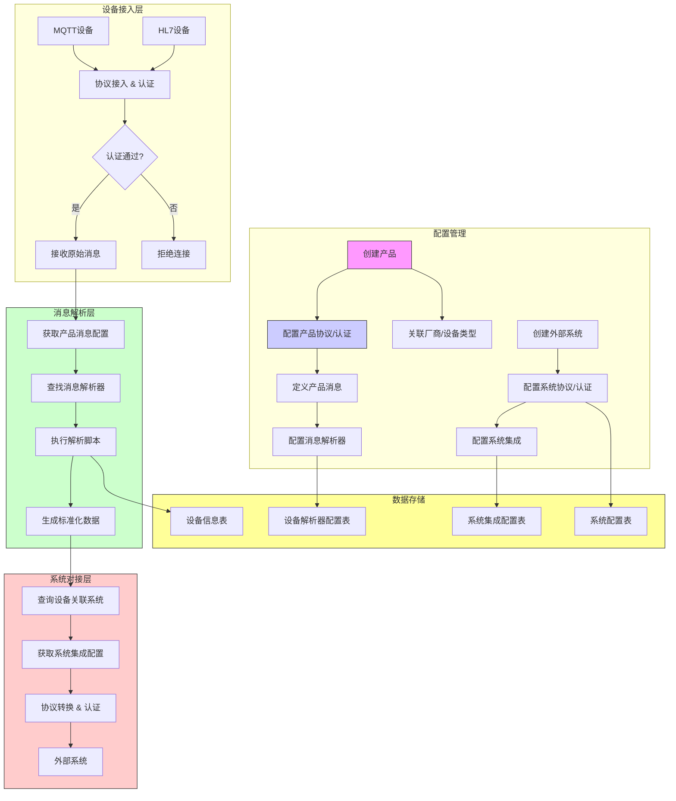

```mermaid
graph TD
    subgraph 配置管理
        A[创建产品] --> B[配置产品协议/认证]
        B --> C[定义产品消息]
        C --> D[配置消息解析器]
        A --> E[关联厂商/设备类型]
        F[创建外部系统] --> G[配置系统协议/认证]
        G --> H[配置系统集成]
    end
    
    subgraph 设备接入层
        I[MQTT设备] --> J[协议接入 & 认证]
        K[HL7设备] --> J
        J --> L{认证通过?}
        L -->|是| M[接收原始消息]
        L -->|否| N[拒绝连接]
    end
    
    subgraph 消息解析层
        M --> O[获取产品消息配置]
        O --> P[查找消息解析器]
        P --> Q[执行解析脚本]
        Q --> R[生成标准化数据]
    end
    
    subgraph 系统对接层
        R --> S[查询设备关联系统]
        S --> T[获取系统集成配置]
        T --> U[协议转换 & 认证]
        U --> V[外部系统]
    end
    
    subgraph 数据存储
        D --> W[设备解析器配置表]
        Q --> X[设备信息表]
        H --> Y[系统集成配置表]
        G --> Z[系统配置表]
    end
    
    style A fill:#f9f,stroke:#333
    style B fill:#ccf,stroke:#333
    style 消息解析层 fill:#cfc,stroke:#333
    style 系统对接层 fill:#fcc,stroke:#333
    style 数据存储 fill:#ff9,stroke:#333
```