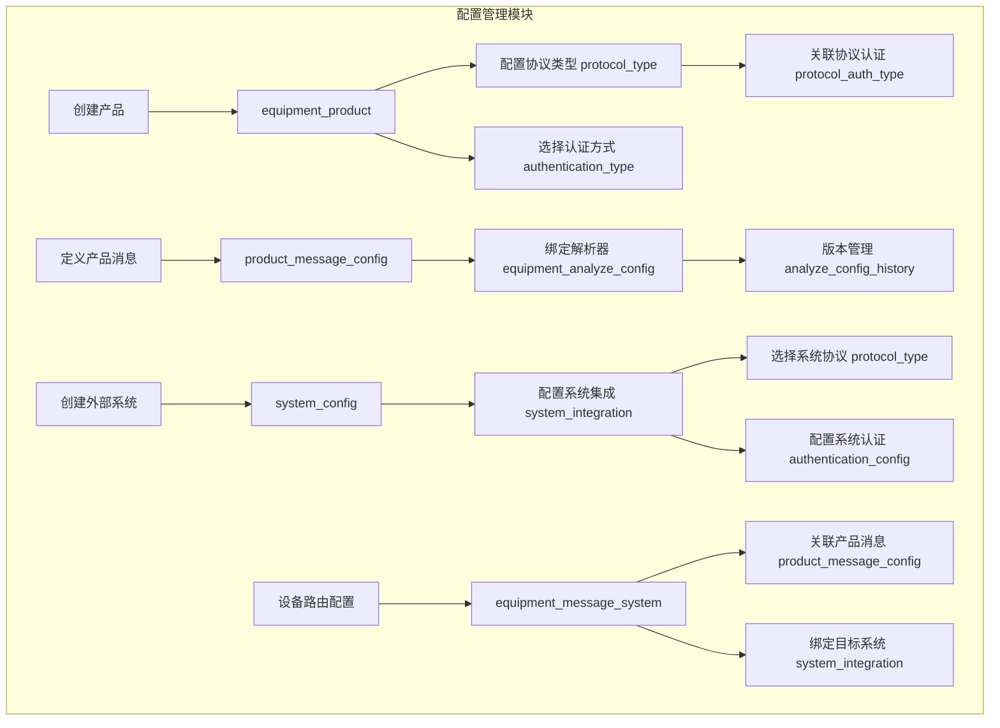

```mermaid
flowchart TD
    subgraph 配置管理模块
        A1[创建产品] --> A2[equipment_product]
        A2 --> A3[配置协议类型 protocol_type]
        A2 --> A4[选择认证方式 authentication_type]
        A3 --> A5[关联协议认证 protocol_auth_type]
        
        B1[定义产品消息] --> B2[product_message_config]
        B2 --> B3[绑定解析器 equipment_analyze_config]
        B3 --> B4[版本管理 analyze_config_history]
        
        C1[创建外部系统] --> C2[system_config]
        C2 --> C3[配置系统集成 system_integration]
        C3 --> C4[选择系统协议 protocol_type]
        C3 --> C5[配置系统认证 authentication_config]
        
        D1[设备路由配置] --> D2[equipment_message_system]
        D2 --> D3[关联产品消息 product_message_config]
        D2 --> D4[绑定目标系统 system_integration]
    end

```