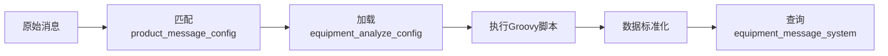

```mermaid
flowchart LR
    RawMsg[原始消息] --> MsgMatch[匹配product_message_config]
    MsgMatch --> LoadParser[加载equipment_analyze_config]
    LoadParser --> ExecScript[执行Groovy脚本]
    ExecScript --> Transform[数据标准化]
    Transform --> Route[查询equipment_message_system]
```