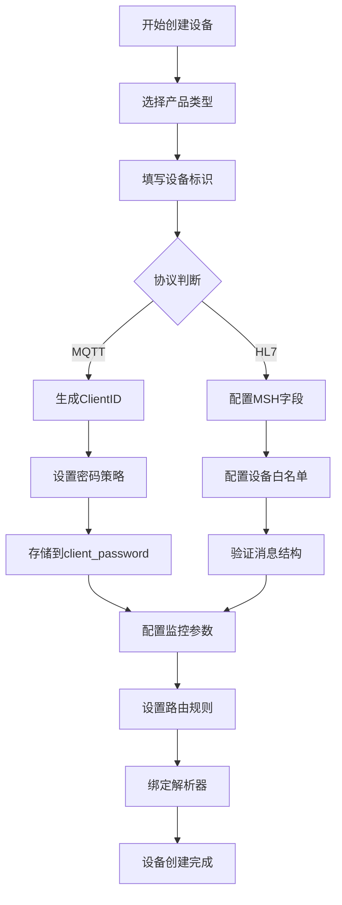

```mermaid
flowchart
    Start[开始创建设备] --> Step1[选择产品类型]
    Step1 --> Step2[填写设备标识]
    Step2 --> Step3{协议判断}
    Step3 -->|MQTT| Step4M[生成ClientID]
    Step3 -->|HL7| Step4H[配置MSH字段]
    
    Step4M --> Step5M[设置密码策略]
    Step5M --> Step6M[存储到client_password]
    
    Step4H --> Step5H[配置设备白名单]
    Step5H --> Step6H[验证消息结构]
    
    Step6M --> Step7[配置监控参数]
    Step6H --> Step7
    Step7 --> Step8[设置路由规则]
    Step8 --> Step9[绑定解析器]
    Step9 --> End[设备创建完成]
```