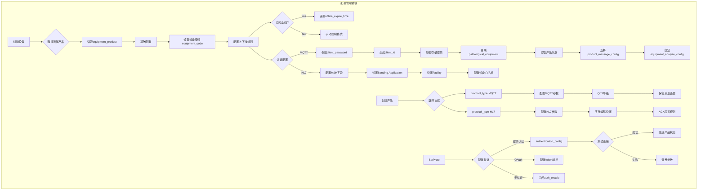

```mermaid
flowchart TD
    subgraph 配置管理模块
        %% 设备创建分支 %%
        NewDevice[创建设备] --> SelectProduct{选择所属产品}
        SelectProduct --> LoadProduct[读取equipment_product]
        LoadProduct --> ConfigBasic[基础配置]
        ConfigBasic --> SetCode[设置设备编码 equipment_code]
        SetCode --> SetOnlineRule[配置上下线规则]
        SetOnlineRule --> AutoOnline{自动上线?}
        AutoOnline -->|Yes| SetExpireTime[设置offline_expire_time]
        AutoOnline -->|No| ManualControl[手动控制模式]
        
        SetOnlineRule --> ConfigAuth{认证配置}
        ConfigAuth -->|MQTT| CreateClient[创建client_password]
        CreateClient --> GenClientID[生成client_id]
        GenClientID --> EncryptPass[加密存储密码]
        EncryptPass --> BindDevice[关联pathological_equipment]
        
        ConfigAuth -->|HL7| SetHL7Identity[配置MSH字段]
        SetHL7Identity --> MSH3[设置Sending Application]
        MSH3 --> MSH4[设置Facility]
        MSH4 --> Whitelist[配置设备白名单]
        
        BindDevice --> LinkMessage[关联产品消息]
        LinkMessage --> ChooseMsg[选择product_message_config]
        ChooseMsg --> BindParser[绑定equipment_analyze_config]
        
        %% 产品配置分支 %%
        NewProduct[创建产品] --> SelectProto{选择协议}
        SelectProto --> MQTTProto[protocol_type-MQTT]
        SelectProto --> HL7Proto[protocol_type-HL7]
        
        MQTTProto --> SetMQTTParams[配置MQTT参数]
        SetMQTTParams --> QoSSetting[QoS等级]
        QoSSetting --> RetainFlag[保留消息设置]
        
        HL7Proto --> SetHL7Params[配置HL7参数]
        SetHL7Params --> Encoding[字符编码设置]
        Encoding --> AckConfig[ACK应答规则]
        
        SetProto --> AuthConfig{配置认证}
        AuthConfig -->|密码认证| CreateAuth[authentication_config]
        AuthConfig -->|OAuth| OAuthConfig[配置token端点]
        AuthConfig -->|无认证| SkipAuth[关闭auth_enable]
        
        CreateAuth --> TestConnection{测试连接}
        TestConnection -->|成功| EnableProduct[激活产品状态]
        TestConnection -->|失败| AdjustParams[调整参数]
    end
```