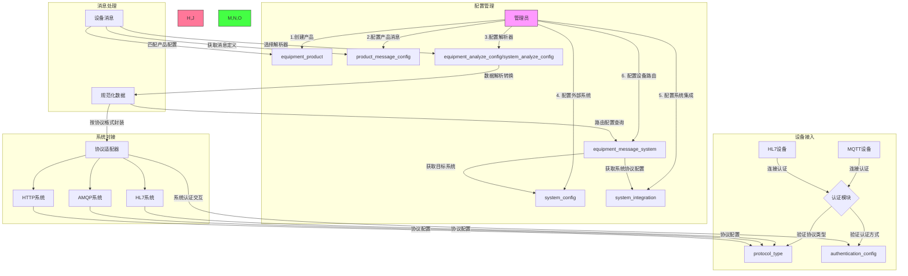

```mermaid
flowchart TD
    subgraph 配置管理
        A[管理员] -->|1.创建产品| B[equipment_product]
        A -->|2.配置产品消息| C[product_message_config]
        A -->|3.配置解析器| D[equipment_analyze_config/system_analyze_config]
        A -->|4. 配置外部系统| E[system_config]
        A -->|5. 配置系统集成| F[system_integration]
        A -->|6. 配置设备路由| G[equipment_message_system]
    end
    
    subgraph 设备接入
        H[MQTT设备] -->|连接认证| I{认证模块}
        J[HL7设备] -->|连接认证| I
        I -->|验证协议类型| protocol_type
        I -->|验证认证方式| authentication_config
    end
    
    subgraph 消息处理
        K[设备消息] -->|匹配产品配置| B
        K -->|获取消息定义| C
        K -->|选择解析器| D
        D -->|数据解析转换| L[规范化数据]
        L -->|路由配置查询| G
        G -->|获取目标系统| E
        G -->|获取系统协议配置| F
    end
    
    subgraph 系统对接
        M[HL7系统] -->|协议配置| protocol_type
        N[AMQP系统] -->|协议配置| protocol_type
        O[HTTP系统] -->|协议配置| protocol_type
        L -->|按协议格式封装| P[协议适配器]
        P -->|系统认证交互| authentication_config
        P --> M
        P --> N
        P --> O
    end
    
    style A fill:#f9f,stroke:#333
    style H,J fill:#f79,stroke:#333
    style M,N,O fill:#4f4,stroke:#333
```