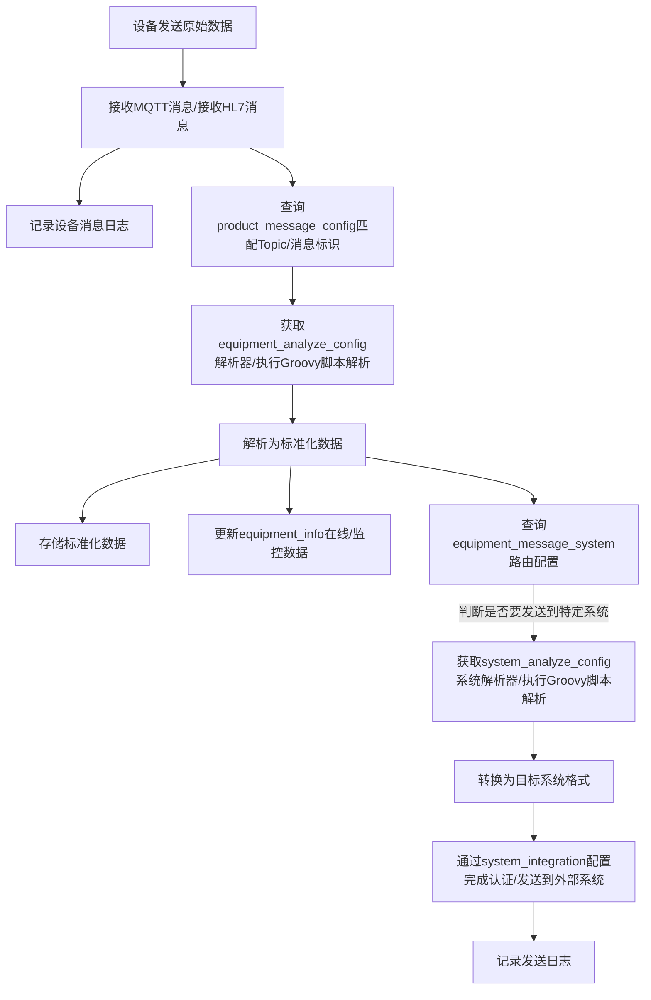

```mermaid
flowchart TD
    A[设备发送原始数据] --> B[接收MQTT消息/接收HL7消息]
    B --> C[记录设备消息日志]
    B --> E[查询product_message_config匹配Topic/消息标识]
    E --> F[获取equipment_analyze_config解析器/执行Groovy脚本解析]
    F --> G[解析为标准化数据]

    G --> M[存储标准化数据]
    G --> O[更新equipment_info在线/监控数据]

    G --> H[查询equipment_message_system路由配置]
    H -->|判断是否要发送到特定系统|J[获取system_analyze_config系统解析器/执行Groovy脚本解析]
    J --> K[转换为目标系统格式]
    K --> L[通过system_integration配置完成认证/发送到外部系统]

    L --> N[记录发送日志]
```