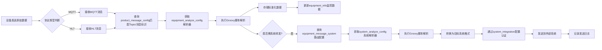

```mermaid
flowchart LR
    A[设备发送原始数据] --> B{协议类型判断}
    B -->|MQTT| C[接收MQTT消息]
    B -->|HL7| D[接收HL7消息]
    
    C --> E[查询product_message_config匹配Topic/消息标识]
    D --> E
    E --> F[获取equipment_analyze_config解析器]
    F --> G[执行Groovy脚本解析]

    G --> M[存储标准化数据]
    M --> O[更新equipment_info监控数据]

    G --> H{是否需系统转发?}
    
    H -->|是| I[查询equipment_message_system路由配置]
    I --> J[获取system_analyze_config系统解析器]
    J --> J1[执行Groovy脚本解析]
    J1 --> K[转换为目标系统格式]
    K --> L[通过system_integration配置认证]
    L --> L1[发送到外部系统]

    L1 --> N[记录发送日志]
```