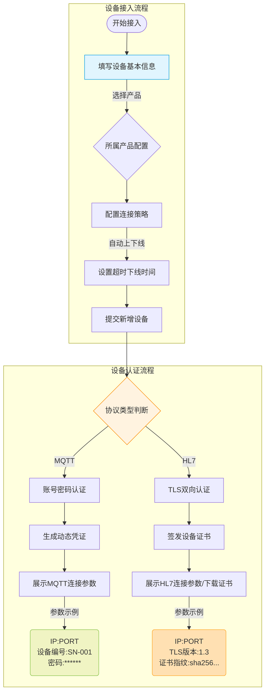

```mermaid
%% 设备接入与认证完整流程
graph TD
    subgraph 设备接入流程
        A([开始接入]) --> B[填写设备基本信息]
        B -->|选择产品| C{"所属产品配置"}
        C --> E[配置连接策略]
        E -->|自动上下线| F[设置超时下线时间]
        F --> H[提交新增设备]
    end

    subgraph 设备认证流程
        H --> I{协议类型判断}
        I -->|MQTT| J[账号密码认证]
        I -->|HL7| K[TLS双向认证]
        
        J --> L[生成动态凭证]
        L --> M[展示MQTT连接参数]
        M -->|参数示例| N("IP:PORT<br/>设备编号:SN-001<br/>密码:******")
        
        K --> O[签发设备证书]
        O --> P[展示HL7连接参数/下载证书]
        P -->|参数示例| Q("IP:PORT<br/>TLS版本:1.3<br/>证书指纹:sha256...")
    end

    style B fill:#E1F5FE,stroke:#039BE5
    style I fill:#FFF3E0,stroke:#FB8C00
    style N fill:#F0F4C3,stroke:#8BC34A
    style Q fill:#FFE0B2,stroke:#FFA726
```